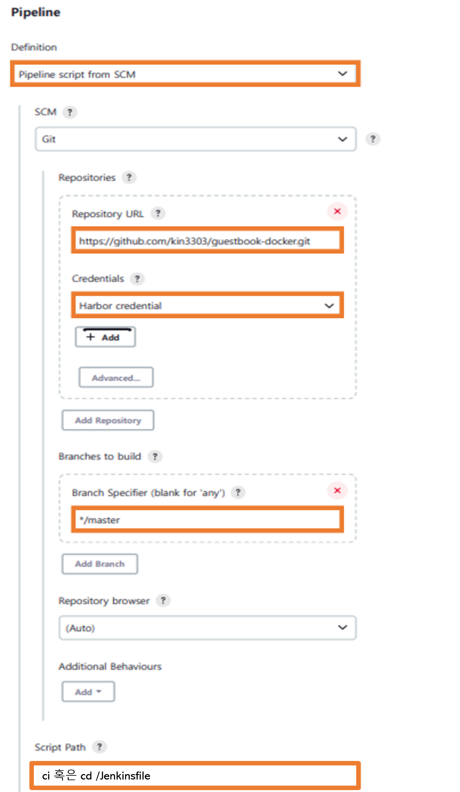

# guestbook-docker

## 시나리오 1 > 단순히 Docker Image 빌드
 
 [App 참고소스](https://github.com/kubernetes/examples/blob/master/guestbook/php-redis/guestbook.php)

```console
 $ git clone https://github.com/kin3303/guestbook-docker.git
 $ cd guestbook-docker
 $ export TAG=<YOUR_TAG> (default : v1)
 $ export REG=<YOUR_REGISTRY>  (default : index.docker.io/kin3303)
 $ docker login
 $ make
``` 

## 시나리오2 > Jenkins Pipeline 으로 사용

###  Jenkins Pipeline 설정방법
 + New Item -> Pipeline
 
  

###  Jenkins Pipeline 구성
  1. app image 빌드 및 harbor 에 이미지 업로드
  2. helm chart 패키징 및 원격 저장소 업로드
     -  [관련소스](https://github.com/kin3303/guestbook)


